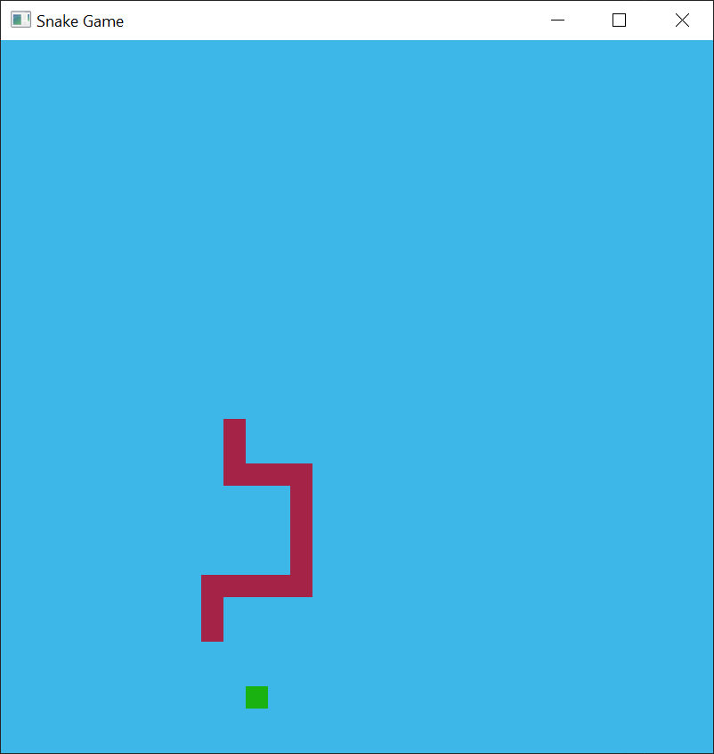
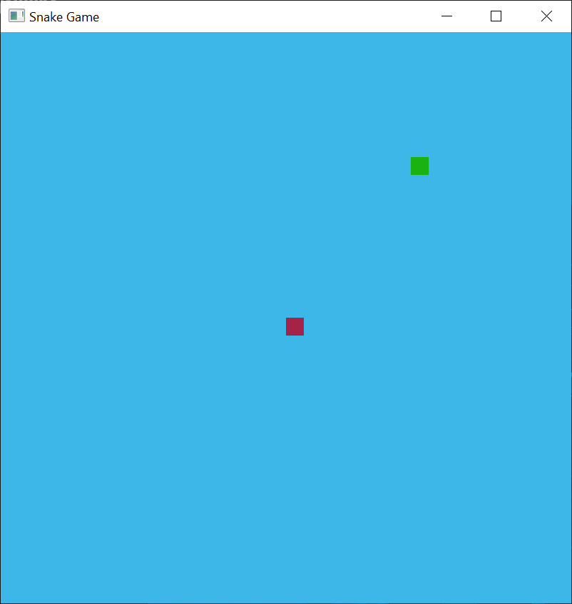
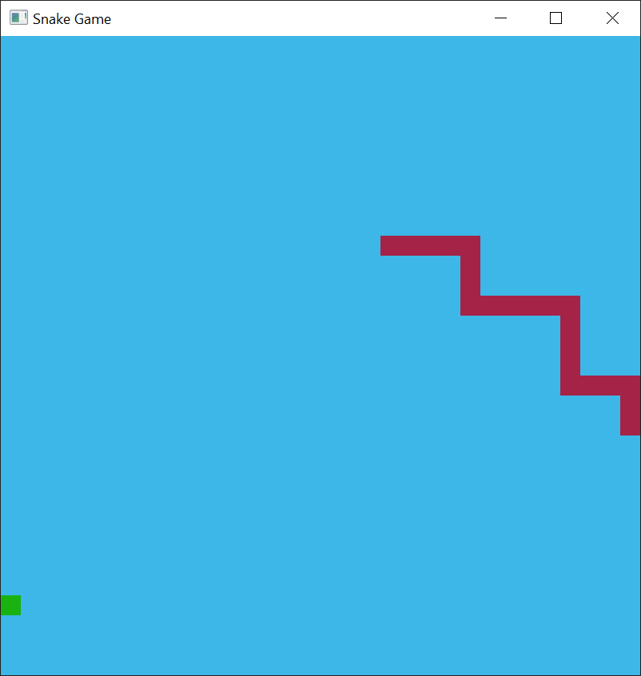

# Snake Game with OpenGL (C++)

## Description

This project is a Snake game implemented in C++ using OpenGL version 3.3. The game offers a classic Snake experience, where you control a snake that grows by eating food, with the goal of avoiding collisions with walls or its own body.

## Requirements
- Microsoft Visual Studio 2022
- OpenGL 3.3+ support

## Running the game

1. Clone the repository: `git clone https://github.com/MisaelVM/SnakeGame.git`
2. Navigate to the project directory: `cd SnakeGame`
3. Open the solution `SnakeGame.sln` with Visual Studio
4. Run the project

## Controls

- `W`, `A`, `S`, `D`, arrow keys: Control the snake.
- `Escape`: Exit the game.

## Screenshots

